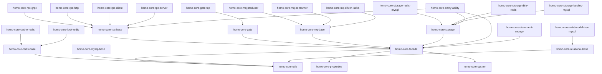

# homo-core 框架总体技术设计文档

## 0. 设计思路与架构概览

### 0.1 设计思路
- 模块化 + 响应式：以 Facade 抽象各域能力，统一以 Homo<T> 串联。
- 数据为中心：读优先缓存、写先缓存后落地，冷数据按需捞起。
- 有状态实体：实体粒度的路由/隔离，降低跨实例同步成本。

### 0.2 总体架构（ASCII）
```text
Gate → RPC → Entity(Ability) → Storage(Redis/Mysql/Mongo)
                          ↘ MQ
未命中 → Landing → 回填 Redis
```

### 0.3 端到端流程（ASCII）
```text
Client → Gate → RPC → Service/Entity → Storage(Redis)
  ↘ MQ → Consumer → Service/Entity
未命中 → Landing → Redis → 返回
```

## 1. 框架概述

### 1.1 框架定位
`homo-core` 是一个专为游戏开发场景设计的全响应式一站式分布式框架，基于 Spring Boot 2.7.2 构建，采用响应式编程模型，支持多种通信协议、存储后端和消息队列，为游戏服务器提供高性能、高可用的技术支撑。

### 1.2 设计目标
- **高性能**：基于响应式编程模型，支持高并发、低延迟
- **高可用**：支持分布式部署，具备故障转移和负载均衡能力
- **易扩展**：模块化设计，支持插件化扩展
- **易使用**：提供简洁的 API 和丰富的工具类
- **易维护**：清晰的架构分层和完整的监控体系

### 1.3 核心特性
- 全响应式编程模型
- 多协议支持（HTTP、gRPC、TCP）
- 多存储后端支持（Redis、MySQL、MongoDB）
- 有状态和无状态服务调用
- 自动化数据落地机制
- 能力系统（Ability System）
- 完整的监控和链路追踪

## 2. 整体架构设计

### 2.1 架构分层

```
┌─────────────────────────────────────────────────────────────┐
│                    业务应用层                                │
├─────────────────────────────────────────────────────────────┤
│                    homo-core-facade                         │
│                   (门面抽象层)                              │
├─────────────────────────────────────────────────────────────┤
│  homo-core-utils  │  homo-core-properties  │  homo-core-system │
│    (工具模块)      │      (配置模块)        │     (系统模块)    │
├─────────────────────────────────────────────────────────────┤
│  homo-core-rpc    │  homo-core-gate       │  homo-core-mq     │
│   (RPC通信)       │     (网关)            │   (消息队列)      │
├─────────────────────────────────────────────────────────────┤
│  homo-core-storage │  homo-core-entity-ability │  homo-core-* │
│     (存储)        │      (实体能力)        │   (其他模块)     │
├─────────────────────────────────────────────────────────────┤
│                    Spring Boot 2.7.2                       │
│                    (基础框架)                              │
└─────────────────────────────────────────────────────────────┘
```

### 2.2 模块依赖关系



## 3. 核心设计理念

### 3.1 响应式编程模型
- **Homo<T>**：基于 Reactor 的自定义响应式类型
- **链式调用**：支持流畅的 API 调用
- **异步非阻塞**：提高系统吞吐量
- **背压控制**：防止系统过载

### 3.2 模块化架构
- **单一职责**：每个模块负责特定功能
- **松耦合**：模块间通过接口交互
- **高内聚**：模块内部功能紧密相关
- **可插拔**：支持模块的动态加载

### 3.3 能力系统
- **组合模式**：通过组合实现功能扩展
- **动态能力**：支持运行时能力管理
- **热插拔**：支持能力的热更新
- **类型安全**：编译时类型检查

### 3.4 有状态服务
- **实体路由**：基于实体 ID 的路由策略
- **状态保持**：确保同一实体的请求路由到同一实例
- **数据一致性**：通过版本控制保证数据一致性
- **故障转移**：支持服务实例的故障转移

## 4. 核心模块分析

### 4.1 门面模块（homo-core-facade）
**职责**：提供统一的抽象接口和数据结构
**核心组件**：
- Service：服务抽象接口
- Ability：能力系统接口
- RpcAgent：RPC 代理接口
- GateDriver：网关驱动接口

**设计特点**：
- 门面模式统一封装
- 支持多种协议抽象
- 能力系统设计
- 响应式编程支持

### 4.2 工具模块（homo-core-utils）
**职责**：提供基础工具类和响应式编程支持
**核心组件**：
- Homo<T>：响应式编程类型
- Module：模块管理接口
- CallQueue：调用队列管理
- 各种工具类

**设计特点**：
- 响应式编程模型
- 模块生命周期管理
- 并发控制机制
- 丰富的工具类

### 4.3 存储模块（homo-core-storage）
**职责**：提供统一的数据存储抽象
**核心组件**：
- StorageDriver：存储驱动接口
- ByteStorage：字节存储
- ObjStorage：对象存储
- DocumentStorage：文档存储

**设计特点**：
- 多级缓存架构
- 自动化落地机制
- 多存储后端支持
- 响应式存储操作

### 4.4 RPC 模块（homo-core-rpc）
**职责**：提供远程过程调用能力
**核心组件**：
- RpcClient：RPC 客户端
- RpcServer：RPC 服务端
- CallDispatcher：调用分发器
- 多种协议实现

**设计特点**：
- 多协议支持
- 服务治理功能
- 有状态调用支持
- 负载均衡和故障转移

### 4.5 网关模块（homo-core-gate）
**职责**：提供客户端连接管理
**核心组件**：
- GateDriver：网关驱动接口
- GateServer：网关服务器
- GateClient：网关客户端
- 消息处理器

**设计特点**：
- 多协议支持
- 连接生命周期管理
- 消息路由和转发
- 负载均衡

### 4.6 消息队列模块（homo-core-mq）
**职责**：提供消息队列能力
**核心组件**：
- MQProducer：消息生产者
- MQConsumer：消息消费者
- 消息序列化器
- 多种队列实现

**设计特点**：
- 多队列支持
- 自动序列化
- 消息路由
- 错误处理

### 4.7 实体能力模块（homo-core-entity-ability）
**职责**：提供实体和能力管理
**核心组件**：
- AbilityEntity：能力实体
- Ability：能力接口
- StorageEntityMgr：实体管理器
- 各种能力实现

**设计特点**：
- 组合模式设计
- 动态能力管理
- 有状态实体支持
- 自动化存储

## 5. 技术栈分析

### 5.1 基础框架
- **Spring Boot 2.7.2**：基础框架
- **Spring Framework**：依赖注入和 AOP
- **Maven**：项目构建和依赖管理

### 5.2 响应式编程
- **Reactor**：响应式编程框架
- **RxJava**：响应式扩展
- **WebFlux**：响应式 Web 框架

### 5.3 通信协议
- **gRPC**：高性能 RPC 框架
- **HTTP/2**：现代 HTTP 协议
- **TCP**：可靠传输协议
- **Netty**：异步网络框架

### 5.4 数据存储
- **Redis**：内存数据库
- **MySQL**：关系型数据库
- **MongoDB**：文档数据库
- **MyBatis**：ORM 框架

### 5.5 消息队列
- **Kafka**：分布式消息队列
- **Redis Pub/Sub**：发布订阅模式

### 5.6 监控和链路追踪
- **Zipkin**：分布式链路追踪
- **Micrometer**：应用指标监控
- **Log4j2**：日志框架

## 6. 设计模式应用

### 6.1 创建型模式
- **工厂模式**：RPC 客户端工厂、存储驱动工厂
- **建造者模式**：配置对象构建
- **单例模式**：工具类、管理器类

### 6.2 结构型模式
- **适配器模式**：不同存储后端的适配
- **装饰器模式**：RPC 拦截器、消息处理器
- **门面模式**：facade 模块统一封装
- **代理模式**：RPC 代理、能力代理

### 6.3 行为型模式
- **观察者模式**：事件通知、配置变更
- **策略模式**：负载均衡策略、序列化策略
- **模板方法模式**：模块初始化流程
- **命令模式**：消息处理命令

## 7. 性能优化策略

### 7.1 响应式编程
- 异步非阻塞 I/O
- 背压控制
- 流式处理
- 资源池化

### 7.2 缓存策略
- 多级缓存架构
- 缓存预热
- 缓存更新策略
- 缓存穿透防护

### 7.3 连接池管理
- 数据库连接池
- Redis 连接池
- HTTP 连接池
- 线程池管理

### 7.4 序列化优化
- 高效序列化算法
- 对象池复用
- 压缩传输
- 批量操作

## 8. 可靠性保证

### 8.1 故障处理
- 熔断器模式
- 重试机制
- 降级处理
- 超时控制

### 8.2 数据一致性
- 版本控制
- 乐观锁
- 最终一致性
- 事务管理

### 8.3 监控告警
- 链路追踪
- 性能监控
- 异常告警
- 健康检查

## 9. 扩展性设计

### 9.1 插件化架构
- 自定义 RPC 协议
- 自定义存储驱动
- 自定义消息队列
- 自定义能力实现

### 9.2 配置驱动
- 注解配置
- 配置文件
- 环境变量
- 配置中心

### 9.3 版本兼容
- 接口版本管理
- 向后兼容
- 平滑升级
- 灰度发布

## 10. 部署和运维

### 10.1 容器化部署
- Docker 镜像
- Kubernetes 部署
- 服务发现
- 配置管理

### 10.2 监控运维
- 应用监控
- 基础设施监控
- 日志聚合
- 告警通知

### 10.3 自动化运维
- CI/CD 流水线
- 自动扩缩容
- 自动故障恢复
- 性能调优

## 11. 使用示例

### 11.1 定义服务接口
```java
@ServiceExport(tagName = "userService:8080", isStateful = true)
public interface UserService {
    Homo<UserInfo> getUserInfo(String userId);
    Homo<Boolean> updateUserInfo(UserInfo userInfo);
}
```

### 11.2 实现服务
```java
@Service
public class UserServiceImpl implements UserService {
    @Autowired
    private StorageEntityMgr entityMgr;
    
    @Override
    public Homo<UserInfo> getUserInfo(String userId) {
        return entityMgr.getOrCreate("user", userId, UserEntity.class)
            .nextDo(user -> user.getAbility(StorageAbility.class).load())
            .nextDo(user -> Homo.result(user.toUserInfo()));
    }
}
```

### 11.3 定义实体
```java
@EntityType(type = "user", isStateful = true)
public class UserEntity extends BaseAbilityEntity<UserEntity> {
    private String name;
    private int level;
    private long exp;
    
    // 业务方法
    public void gainExp(long exp) {
        this.exp += exp;
        checkLevelUp();
    }
}
```

### 11.4 使用实体
```java
@Service
public class UserService {
    @Autowired
    private StorageEntityMgr entityMgr;
    
    public void createUser(String userId, String name) {
        entityMgr.getOrCreate("user", userId, UserEntity.class)
            .nextDo(user -> {
                user.setName(name);
                user.setLevel(1);
                user.setExp(0);
                return user.attachAbility(new StorageAbility());
            })
            .nextDo(user -> user.attachAbility(new CallAbility(user)))
            .start();
    }
}
```

## 12. 最佳实践

### 12.1 开发规范
- 遵循响应式编程模式
- 合理使用能力系统
- 注意资源释放
- 异常处理规范

### 12.2 性能优化
- 合理使用缓存
- 避免阻塞操作
- 优化数据库查询
- 监控性能指标

### 12.3 运维建议
- 定期备份数据
- 监控系统状态
- 及时处理告警
- 定期性能调优

## 13. 总结

`homo-core` 框架通过其精心设计的模块化架构和响应式编程模型，为游戏服务器开发提供了一个强大而灵活的技术平台。其核心设计理念包括：

1. **响应式编程**：全框架采用响应式编程模型，提供高性能的异步处理能力
2. **模块化设计**：清晰的模块分层和依赖关系，支持灵活的扩展和定制
3. **能力系统**：基于组合模式的能力系统，实现功能的动态组合和扩展
4. **有状态服务**：支持有状态的实体管理，满足游戏服务器的特殊需求
5. **多协议支持**：支持多种通信协议和存储后端，适应不同的技术需求

该框架的成功设计为游戏服务器开发提供了坚实的技术基础，既保证了系统的高性能和可扩展性，又提供了良好的开发体验和维护性。通过持续的技术演进和社区贡献，`homo-core` 框架将继续为游戏行业的技术发展贡献力量。

---

## 13. 跨模块端到端流程（补充）
```text
Client → Gate(TCP/HTTP) → RPC(Server) → Entity(Ability) → Storage(Redis)
                                   ↘ MQ(Producer) → MQ → Consumer ↗
未命中 → Landing(Mysql/Mongo) ↗
```

## 14. 观测与治理统一规则
- MDC 标准键：traceId/spanId/requestId/appId/regionId/serverName/userId
- 指标域：RPC（qps/rt/error）/Gate（conn/qps）/Storage（hit/landing）/MQ（produce/consume）
- 采样：与 Zipkin 采样一致；高 QPS 接口降采样 DEBUG 日志

## 15. 可靠性清单
- [ ] RPC 超时/重试/熔断配置齐备
- [ ] Gate 连接/包长/速率限流
- [ ] Storage 落地失败有降级与错误表
- [ ] MQ 消费可重试与死信处理（可扩展）
- [ ] 所有入口均恢复 MDC
